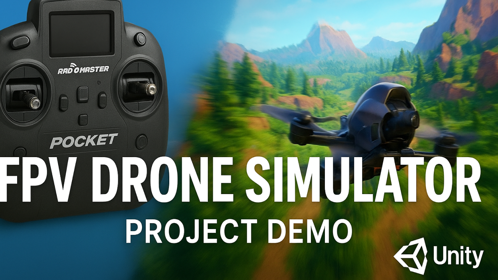

# Unity FPV Drone Simulator

This is a physics-based FPV (First-Person View) drone simulator I built in Unity as a digital assignment for my Game Programming course. The primary goal was to create a realistic flight experience by interfacing a real-world RC (Radio-Controlled) transmitter (a Radiomaster Pocket) with the Unity game engine.

The project's core is a C# script, `DroneController.cs`, which functions as a complete flight controller. It processes user input from the radio, applies advanced input shaping (like deadzones and expo curves), and translates it into physical forces and torques to control a Rigidbody component.

## Live Project Demo

Click the thumbnail below to watch the full video demonstration of the simulator in action, including a breakdown of the flight modes and OSD.

[](https://youtu.be/6hnOlN6PqiQ)

---

## Core Features

- **Real RC Controller Integration**: Connects to a Radiomaster Pocket (or any generic USB joystick) using Unity's modern Input System.

- **Physics-Based Flight**: All movement is driven by Unity's physics engine (`Rigidbody.AddForce` and `Rigidbody.AddRelativeTorque`) for realistic acceleration, gravity, and momentum.

- **Three Flight Modes**: A complete implementation of the three standard FPV flight modes, selectable via a switch on the controller:
  - **Angle Mode**: A self-leveling mode for beginners, built with a PD-Controller.
  - **Acro Mode**: A full manual "rate" mode used by FPV pilots for tricks and flips.
  - **Horizon Mode**: A hybrid mode that self-levels but still allows for full acrobatic flips.

- **Realistic Input Processing**: Advanced C# logic to make the controls "feel" right:
  - **Input Deadzone**: Fixes hardware "stick drift" from the controller.
  - **Expo Curves (Acro & Throttle)**: Provides fine-grained control near the center of the sticks without sacrificing high-speed rotation at the edges.
  - **Active Yaw Damping**: A "brake" on the yaw axis to provide a "locked-in" feel and prevent unwanted spinning.

- **On-Screen Display (OSD)**: A functional, real-time UI that mimics a real FPV feed, displaying:
  - Current Flight Mode
  - Throttle Percentage
  - Altitude (m)
  - Velocity (m/s)

- **3rd Person Camera**: A smooth, dampened `LateUpdate` camera (`CameraController.cs`) that follows the drone.

---

## Tech Stack & Assets

- **Engine**: Unity (tested with 2021.3LTS)
- **Language**: C#
- **Input**: Unity's New Input System Package
- **Hardware**: Radiomaster Pocket (ELRS) in USB Joystick (HID) Mode
- **Assets**:
  - Environment: [Lowpoly Environment - Nature](link)
  - Drone Model: [Simple Drone](link)

---

## Project Setup & How to Run

### Prerequisites

- Unity Hub
- Unity 2021.3LTS (or newer)
- Git
- A USB Joystick / RC Controller (this project is not mapped for keyboard/mouse)

### Installation Steps

1. Clone this repository to your local machine:
   ```bash
   git clone https://github.com/YourUsername/YourRepoName.git
   ```

2. Open Unity Hub and click "Add project from disk," then select the cloned folder.

3. Open the project in the Unity Editor.

4. Open the main scene, located in `Assets/Scenes/`.

5. Press Play.

### ⚠️ Important: Controller Configuration

The input bindings are pre-mapped to my Radiomaster Pocket controller, which has specific axis names.

If you are using an Xbox controller, a different radio, or your controls do not work, you MUST remap the axes.

1. Go to **Project Settings > Input System**.
2. In the Assets window, find the **DroneControls Input Action Asset** and double-click it.
3. Click on each Action (Throttle, Yaw, Pitch, Roll) and change its **Binding path** to match your controller's axes.

#### My Mappings (Radiomaster Pocket):

| Physical Control (Mode 2) | Detected Axis | Mapped Action |
|---------------------------|---------------|---------------|
| Left Stick Up/Down | Z Axis | Throttle |
| Left Stick Left/Right | Rx Axis | Yaw |
| Right Stick Up/Down | Y Axis (Stick/Y) | Pitch |
| Right Stick Left/Right | X Axis (Stick/X) | Roll |
| 3-Position Switch | Rz Axis | FlightModes |

---

## In-Depth Logic: How It Works

This simulator is not just a simple "move forward on key press." It's a complex system that balances four distinct concepts: hardware integration, physics, flight modes, and input shaping.

### 1. Hardware Integration (Radiomaster Pocket)

The Radiomaster Pocket is a hobby-grade RC transmitter. While its main "ELRS" feature is for long-range radio communication, it also has a "USB Joystick (HID)" mode.

When this mode is selected and the radio is plugged into the PC via USB-C, the computer's operating system (Windows/macOS) automatically detects it as a standard game controller—no custom drivers are needed.

### 2. The Three Flight Modes (The "Brain")

The `DroneController.cs` script's main job is to switch between three different control philosophies. A `PlayerInput` component calls the `OnFlightModes()` function when I flick the switch, which updates a `currentMode` variable. The `FixedUpdate()` loop then calls one of these three functions:

#### HandleAngleMode() (The Beginner Mode)

This is a self-leveling mode. The stick input controls the drone's target tilt angle.

**Logic**: When I push the stick forward, the code sets a `targetPitch` (e.g., 20 degrees). It then compares this target to the drone's `currentPitch`. The difference is the "error."

**PD-Controller**: This error is fed into a PD-Controller (Proportional-Derivative) I wrote:
- The **P (Proportional)** term (`stabilizationStrength`) is the "spring." It applies a strong torque to push the drone toward the target angle.
- The **D (Derivative)** term (`stabilizationDamping`) is the "brake." It measures the speed of rotation and applies a counter-torque to stop the P-term from overshooting and wobbling.

**Result**: When I let go of the stick, the `targetPitch` becomes 0, and the PD-controller automatically and smoothly returns the drone to a flat, level position.

#### HandleAcroMode() (The FPV Pro Mode)

This is a rate mode, which is what real FPV pilots use. The stick input controls the drone's rate of rotation (angular velocity).

**Logic**: The stick input (after processing) is multiplied by a `pitchTorque` value. This resulting value is applied directly as a rotational force.

**Result**: When I push the stick forward, the drone rotates at a constant speed (e.g., 200 degrees/sec). When I center the stick, the input becomes 0, the torque becomes 0, and the drone instantly stops rotating and holds its current angle. This is the key that allows for acrobatic flips and rolls.

#### HandleHorizonMode() (The Hybrid Mode)

This mode is a simple combination of the other two. In the code, it literally just calls both the `HandleAcroMode()` and `HandleAngleMode()` logic at the same time (with a slightly weaker stabilization). This creates a "best of both worlds" feel where you can do full flips, but the drone will still self-level if you center the sticks.

### 3. Achieving the "Feel" (Input Processing)

The most difficult part of the project was making the controls "feel" right. Raw input is too "twitchy" and suffers from hardware flaws. I wrote three key processing functions:

- **ApplyDeadzone()**: My radio's sticks don't return to a perfect 0.00. They might rest at 0.015. This "stick drift" would cause the drone to constantly rotate in Acro mode. This function checks if the input is below a tiny threshold (e.g., 0.07) and, if so, treats it as 0. This is what creates the "locked-in" feel.

- **ApplyExpo()**: A linear input is very sensitive. A small stick movement makes the drone rotate just as fast as a large one (relative to the input). Expo applies a cubic curve to the input. This makes the center of the stick less sensitive (for small, precise corrections) while keeping the edges of the stick very sensitive (for fast flips). This is essential for both Acro and Throttle control.

- **yawDamping**: In my early tests, the drone would spin on its Yaw axis and never stop. I added an active damping force. The code now measures the current yaw rotation speed (`currentYawRate`) and applies an opposite torque (`-currentYawRate * yawDamping`) to act as a powerful brake when the yaw stick is centered.

---

## Code Highlights

Here are a few key snippets from `DroneController.cs` that power the simulation.

### Snippet 1: The Main HandleMovement() Loop

This runs every `FixedUpdate()` and is the "brain" that selects which physics to apply.

```csharp
private void HandleMovement()
{
    // Apply throttle with expo
    float processedThrottle = ApplyExpo(throttleInput, throttleExpo);
    rb.AddForce(transform.up * (processedThrottle * thrustForce), ForceMode.Acceleration);

    // Apply yaw with expo and active damping
    float processedYaw = ApplyExpo(yawInput, acroExpo) * yawTorque;
    float currentYawRate = transform.InverseTransformDirection(rb.angularVelocity).y;
    float yawDampingTorque = -currentYawRate * yawDamping;

    rb.AddRelativeTorque(Vector3.up * (processedYaw + yawDampingTorque), ForceMode.Acceleration);

    // Switch between the flight mode logic
    switch (currentMode)
    {
        case FlightMode.Acro:
            HandleAcroMode();
            break;
        case FlightMode.Angle:
            HandleAngleMode();
            break;
        case FlightMode.Horizon:
            HandleHorizonMode();
            break;
    }
}
```

### Snippet 2: HandleAngleMode() (The PD-Controller)

This is the complete logic for the self-leveling mode.

```csharp
private void HandleAngleMode()
{
    // Get target angle from stick input
    float targetPitch = pitchInput * maxTiltAngle;
    float targetRoll = -rollInput * maxTiltAngle;

    // Get current angles
    Vector3 localEuler = transform.localEulerAngles;
    float currentPitch = ConvertAngle(localEuler.x);
    float currentRoll = ConvertAngle(localEuler.z);

    // Calculate the error
    float pitchError = targetPitch - currentPitch;
    float rollError = targetRoll - currentRoll;

    Vector3 localAngularVel = transform.InverseTransformDirection(rb.angularVelocity);

    // Calculate the final corrective torque using the PD formula
    // P-Force = error * strength
    // D-Force = velocity * damping
    float pitchPD = (pitchError * stabilizationStrength) - (localAngularVel.x * stabilizationDamping);
    float rollPD = (rollError * stabilizationStrength) - (localAngularVel.z * stabilizationDamping);

    rb.AddRelativeTorque(new Vector3(pitchPD, 0, rollPD), ForceMode.Acceleration);
}
```

### Snippet 3: HandleAcroMode() (The Rate Controller)

This is the simple, powerful logic for expert FPV flight.

```csharp
private void HandleAcroMode()
{
    // Apply expo to the deadzoned input
    float processedPitch = ApplyExpo(pitchInput, acroExpo);
    float processedRoll = ApplyExpo(rollInput, acroExpo);

    // Apply torque directly from the processed input
    Vector3 acroTorque = new Vector3(processedPitch * pitchTorque, 0, -processedRoll * rollTorque);
    rb.AddRelativeTorque(acroTorque, ForceMode.Acceleration);
}
```

### Snippet 4: Input Processing Functions

These two functions are the key to making the controls "feel" good.

```csharp
private float ApplyDeadzone(float input)
{
    // If the input is smaller than the deadzone, treat it as 0
    if (Mathf.Abs(input) < inputDeadzone)
    {
        return 0f;
    }
    // Otherwise, rescale the input to maintain a full 0-1 range
    return Mathf.Sign(input) * ((Mathf.Abs(input) - inputDeadzone) / (1f - inputDeadzone));
}

private float ApplyExpo(float input, float expo)
{
    // This simple cubic formula flattens the center of the stick response
    return (expo * (input * input * input)) + ((1f - expo) * input);
}
```

### Snippet 5: Input System Handlers

These public functions are called by the `PlayerInput` component (using Unity Events) to feed data from the controller into the script.

```csharp
public void OnThrottle(InputValue value)
{
    float rawInput = value.Get<float>();
    // Remap stick from [-1, 1] range to [0, 1] range
    throttleInput = (rawInput + 1f) / 2f; 
}

public void OnYaw(InputValue value)
{
    // Apply deadzone immediately to prevent drift
    yawInput = ApplyDeadzone(value.Get<float>());
}

public void OnPitch(InputValue value)
{
    pitchInput = ApplyDeadzone(value.Get<float>());
}

public void OnRoll(InputValue value)
{
    rollInput = ApplyDeadzone(value.Get<float>());
}

public void OnFlightModes(InputValue value)
{
    float rzValue = value.Get<float>(); // 3-pos switch gives -1, 0, or 1
    if (rzValue < -0.5f)
    {
        currentMode = FlightMode.Angle; // Swapped from original to match my switch
    }
    else if (rzValue > 0.5f)
    {
        currentMode = FlightMode.Acro; // Swapped from original
    }
    else
    {
        currentMode = FlightMode.Horizon;
    }
}
```

### Snippet 6: OSD Controller Logic

This snippet from `OSDController.cs` shows how the UI gets live data from the drone.

```csharp
// Public reference to the drone, linked in the Inspector
public DroneController drone; 

// UI Text elements, linked in the Inspector
public TMP_Text modeText;
public TMP_Text throttleText;
public TMP_Text altitudeText;
public TMP_Text velocityText;

private float initialAltitude;

void Start()
{
    // Get the starting altitude so we can measure relative height
    if (drone != null)
    {
        initialAltitude = drone.transform.position.y;
    }
}

void Update()
{
    if (drone == null) return; // Don't do anything if drone isn't linked

    // Update all the text fields
    modeText.text = $"MODE: {drone.CurrentMode.ToString().ToUpper()}";
    throttleText.text = $"THR: {drone.ThrottleInput:P0}";

    float altitude = drone.transform.position.y - initialAltitude;
    altitudeText.text = $"ALT: {altitude:F1} m";

    float velocity = drone.Rb.velocity.magnitude;
    velocityText.text = $"VEL: {velocity:F1} m/s";
}
```

---

## Documentation

You can view the full project documentation here:

[📄 Documentation.pdf](./Documentation/Game_Programming_Digital_Assignment_22BAI1259.pdf)

---

## Credits

- **3D Drone Model**: [Simple Drone](https://assetstore.unity.com/packages/3d/vehicles/air/simple-drone-190684) by S. G.
- **3D Environment**: [Lowpoly Environment - Nature](https://assetstore.unity.com/packages/3d/environments/lowpoly-environment-nature-free-medieval-fantasy-series-187052) by Z-Brothers-Art

---

## License

This project is licensed under the MIT License. See the LICENSE file for details.

---

## Author

**Venkatesan M** (22BAI1259)